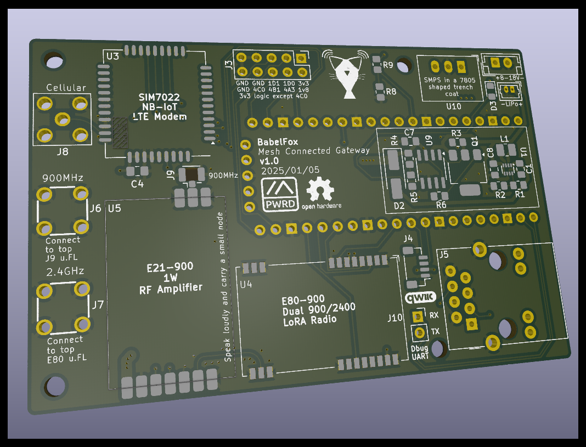

**NOTE: This project is not quite ready for prime time. Everything could be subject to change; build at your own risk. More documentation will come on full release.**

## What is this?
**BabelFox** is a project to create an energy efficient yet high performance Meshtastic "remote gateway node" -- one which not only has a wide TX/RX range on the mesh, but also can bridge the gap to other communication protocols, *without the need for any additional equipment*. It is equipped with a LoRA module based on the **Semtech LR1121** chip, which not only provides better RX performance than the standard SX1262 used by most Meshtastic hardware, but also includes 2.4GHz LoRA capability. It is also equipped with a **SIMCom SIM7022** LTE modem, which provides low power NB-IoT internet connectivity, with global cellular band support.

## Specifications
**Form factor:** RPi compatible (85x56mm, with 58x49mm spaced mounting holes)

**Main Processor:** Luckfox Pico (based on Rockchip RV1103)

**LoRA Radio:** EByte E80-900 (based on Semtech LR1121)

**900MHz Amplifier:** EByte E21-900 1W PA/LNA

**Cell Radio:** SIMCom SIM7022

**Max LoRA TX Power:** 30dBm @ 900MHz, 13dBm @ 2.4GHz

**Power Source:** USB-C (5V only), 3.7V LiPo, 8-18V VDC

**Power Consumption:** ~5W peak, <3W nominal

## License

**Spearmintastic** is licensed under the CERN OHL v2 Permissive license. See the *LICENSE* file for more information.